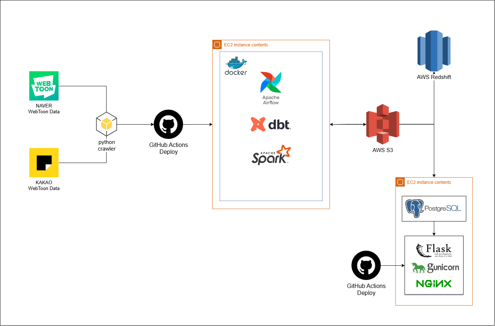
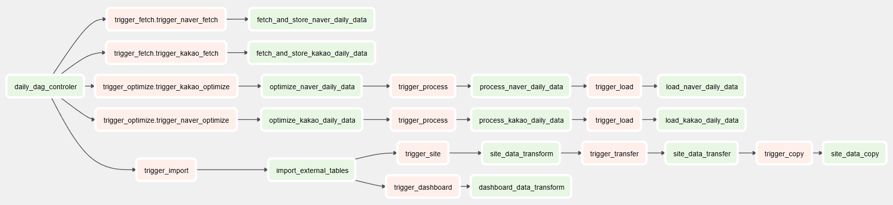
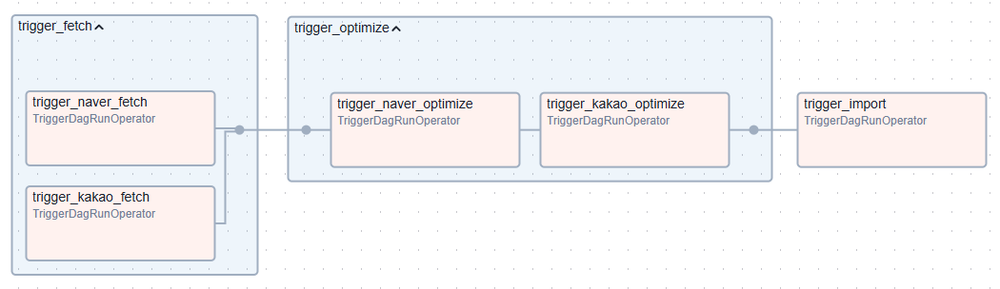
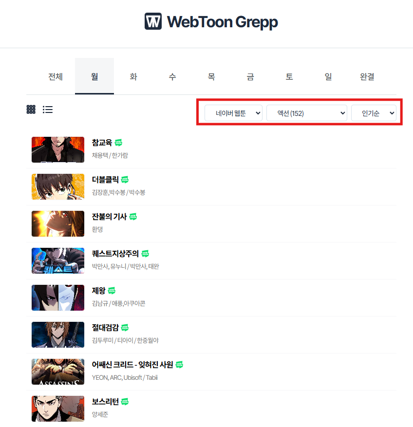
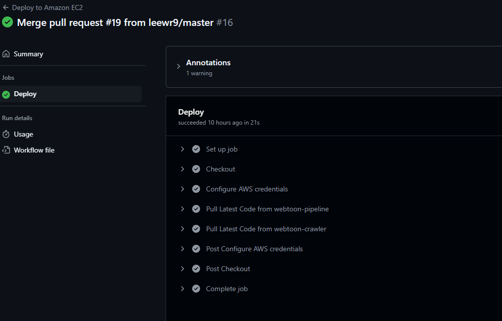
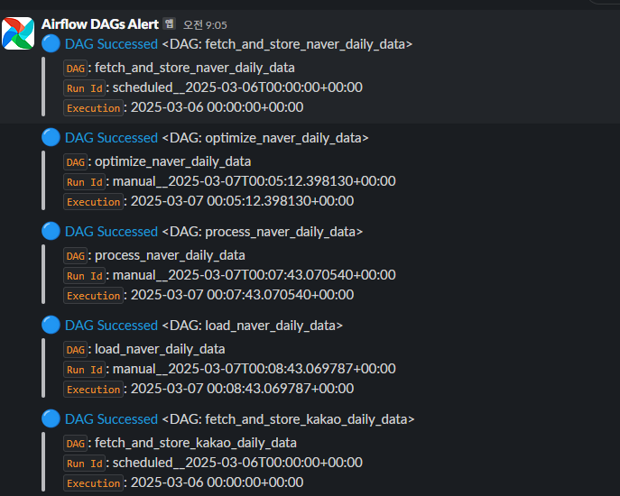
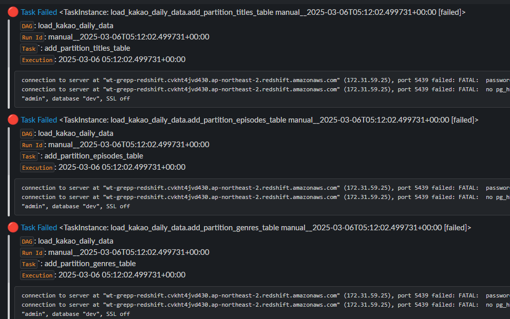

# WebToon Grepp 프로젝트 보고서

## **1. 개요**

웹툰 시장은 급속도로 성장하고 있으며, 사용자들의 소비 패턴을 분석하는 것이 중요해지고 있습니다. 본 프로젝트는 네이버 및 카카오 웹툰 데이터를 크롤링하여 조회수, 댓글 수, 좋아요 수, 장르별 통계를 분석하는 데이터 파이프라인을 구축하는 것을 목표로 합니다. 이를 통해 사용자들에게 인사이트를 제공하고, 데이터 기반 의사 결정을 지원할 수 있도록 합니다.



## **2. 프로젝트 팀원 및 역할**

### **2.1. 이우람**

- **카카오 웹툰 크롤링**: Python을 활용하여 카카오 웹툰 데이터를 수집
- **데일리 데이터 ETL**: Apache Spark를 사용하여 일별 데이터 처리
- **데이터 파이프라인 관리**: Apache Airflow를 이용한 자동화
- **AWS 리소스 관리**: EC2, S3, Redshift 등의 AWS 서비스 운영
- **홈페이지 제작**: Flask 및 프로덕션 DB를 활용한 데이터 시각화 및 제공

### **2.2. 정용선**

- **네이버 웹툰 크롤링**: Python을 활용하여 네이버 웹툰 데이터 수집
- **과거 데이터 ETL**: Spark를 활용하여 과거 대용량 데이터를 정제 및 적재
- **크롤링 개선**: Python 멀티쓰레딩과 Concurrent 모듈을 활용하여 속도 개선

### **2.3. 최은주**

- **실사용 데이터 ELT**: dbt를 활용한 데이터 모델링 및 변환
- **대시보드 제작**: Tableau를 활용한 데이터 시각화 및 리포팅

## 3. 기술 스택

### **3.1. 데이터 수집 (크롤링)**

- Python, Requests

### **3.2. 데이터 파이프라인 및 처리**

- Apache Airflow (워크플로우 자동화)
- Apache Spark (데이터 처리 및 변환)
- dbt (데이터 변환 및 모델링)

### **3.3. 인프라 및 저장소**

- AWS EC2 (서버 인프라)
- AWS S3 (데이터 저장소)
- AWS Redshift (데이터 웨어하우스)
- PostgreSQL (데이터베이스)

### **3.4. 데이터 시각화 및 애플리케이션**

- Tableau (데이터 시각화)
- Flask (웹 애플리케이션)

### **3.5. 배포 및 운영**

- Docker (컨테이너화)
- Nginx (웹 서버 및 리버스 프록시)
- GitHub, GitHub Actions (버전 관리 및 CI/CD)
- Gunicorn (WSGI 서버)

## **4. 데이터 파이프라인**

본 프로젝트에서는 다음과 같은 데이터 파이프라인을 설계하였습니다.

**DAG Dependencies**



- **daily_dag_controller Graph**
    
    
    

### **4.1. 데이터 크롤링**

- **목표**: 네이버와 카카오 웹툰에서 웹툰 데이터를 수집합니다.
    - **사용 기술**: Python, Requests
    - **세부 과정**:
        - 네이버와 카카오 웹툰에서 웹툰의 제목, 회차별 조회수, 댓글, 좋아요 수 등의 데이터를 크롤링합니다.
        - 수집된 원시 데이터는 **S3**에 저장됩니다.
- **저장 형식**
    - **S3 저장 경로**: `raw/` 폴더 안에 웹툰별, 회차별 정보가 JSON 형식으로 저장됩니다.
    - 예시: `raw/`, `raw/titles/`, `raw/title_info/`, `raw/episode_info/` 등

---

### **4.2. 데이터 정제 및 변환**

- **데이터 정제 및 최적화**
    - **목표**: 수집된 원시 데이터를 분석 및 시각화에 적합한 형식으로 최적화하고 정제합니다.
    - **사용 기술**: Apache Spark, PySpark
    - **세부 과정**:
        - 여러 개의 파일로 나뉜 원시 데이터를 하나로 통합
        - 중복된 웹툰 정보를 제거하고 결측값을 처리
        - 효율적인 분석을 위해 데이터를 변환 후 Parquet 형식으로 저장
- **저장 경로 및 형식**
    - **최적화된 데이터**는 `optimized/` 폴더에 Parquet 형식으로 저장됩니다.
        - 예시: `optimized/titles/`, `optimized/title_info/`, `optimized/episode_info/`
    - **정제된 데이터**는 `processed/` 폴더에 Parquet 형식으로 저장됩니다.
        - 예시: `processed/titles/`, `processed/title_info/`, `processed/episode_info/`
- **S3 구조**
    
    ```python
    s3/
    │
    ├── raw/                    # 추후 활용을 위한 원시 데이터
    │   ├── naver/              # 네이버 웹툰 관련 데이터
    │   │   ├── titles/         # 전체 웹툰 목록
    │   │   │   └── YYYY/MM/DD/titles.json
    │   │   ├── finished_titles/ # 완결 웹툰 목록
    │   │   │   └── YYYY/MM/DD/finished_titles_{page_no}.json
    │   │   ├── title_info/     # 웹툰 상세 정보
    │   │   │   └── YYYY/MM/DD/{title_id}.json
    │   │   ├── episodes/       # 회차 목록
    │   │   │   └── YYYY/MM/DD/{title_id}/episodes_{page_no}.json
    │   │   ├── episode_info/   # 회차별 상세 정보
    │   │   │   └── YYYY/MM/DD/{title_id}/{episode_id}.json
    │   │   ├── comments/       # 댓글 데이터
    │   │   │   └── YYYY/MM/DD/{title_id}/{episode_id}.json
    │   │   └── episode_likes/  # 회차별 좋아요 수
    │   │       └── YYYY/MM/DD/{title_id}/{episode_id}.json
    │   │
    │   └── kakao/              # 카카오 웹툰 관련 데이터
    │       ├── titles/         # 요일별 웹툰 목록
    │       │   └── YYYY/MM/DD/titles_{day}.json
    │       ├── finished_titles/ # 완결 웹툰 목록
    │       │   └── YYYY/MM/DD/finished_titles.json
    │       ├── title_info/     # 웹툰 상세 정보
    │       │   └── YYYY/MM/DD/{title_id}.json
    │       ├── episodes/       # 회차 목록
    │       │   └── YYYY/MM/DD/{title_id}/episodes.json
    │       ├── comments/       # 댓글 데이터
    │       │   └── YYYY/MM/DD/{title_id}/{episode_id}.json
    │       └── episode_likes/  # 회차별 좋아요 수
    │           └── YYYY/MM/DD/{title_id}/{episode_id}.json
    │
    ├─ optimized/               # 최적화된 데이터 (raw -> Spark 진행)
    │   ├── titles/             # 최적화된 요일별 웹툰 목록
    │   │   └── year=YYYY/month=MM/day=DD/platform={platform}/titles.parquet
    │   ├── finished_titles/    # 최적화된 완결 웹툰 목록
    │   │   └── year=YYYY/month=MM/day=DD/platform={platform}/titles.parquet
    │   ├── title_info/         # 최적화된 상세 정보
    │   │   └── year=YYYY/month=MM/day=DD/platform={platform}/title_id={title_id}/episodes.parquet
    │   ├── episodes/           # 최적화된 회차 목록
    │   │   └── year=YYYY/month=MM/day=DD/platform={platform}/titles.parquet
    │   ├── comments/           # 최적화된 댓글 데이터
    │   │   └── year=YYYY/month=MM/day=DD/platform={platform}/title_id={title_id}/episodes.parquet
    │   └── episode_likes/      # 최적화된 회차별 좋아요 수
    │       └── year=YYYY/month=MM/day=DD/platform={platform}/genres.parquet
    │
    └── processed/              # 실제 사용할 데이터 (optimized -> Spark 진행)
        ├── titles/             # 정제된 웹툰 목록
        │   └── year=YYYY/month=MM/day=DD/platform={platform}/titles.parquet
        ├── episodes/           # 정제된 회차 정보
        │   └── year=YYYY/month=MM/day=DD/platform={platform}/title_id={title_id}/episodes.parquet
        └── genres/             # 정제된 장르 목록
            └── year=YYYY/month=MM/day=DD/platform={platform}/genres.parquet
    
    ```
    

---

### **4.3. 데이터 적재 자동화**

- **Airflow DAGs 구성**
    - **목표**: 웹툰 데이터 수집부터 변환 및 적재까지의 모든 작업을 자동화합니다.
    - **사용 기술**: Apache Airflow
    - **세부 과정**:
        - `fetch_and_store_<platform>_daily_data`: 웹툰 데이터를 크롤링하고 S3에 저장
        - `optimize_<platform>_daily_data`: 원시 데이터를 최적화하여 Parquet 형식으로 변환 후 저장
        - `process_<platform>_daily_data`: 분석 가능한 형태로 변환
        - `load_<platform>_daily_data`: Redshift Spectrum으로 데이터를 적재
- **DAG 흐름**
    - 각 DAG는 정해진 주기에 따라 실행되며, 순차적으로 작업이 수행됩니다:
        1. `fetch_and_store_data`: 데이터 크롤링
        2. `optimize_data`: 데이터 최적화
        3. `process_data`: 데이터 분석 준비
        4. `load_data`: 데이터 적재

---

### **4.4. 데이터 모델링 및 분석**

- **데이터 모델링**
    - **목표**: 수집된 데이터를 분석 가능한 형태로 모델링하고, 검증을 위한 테스트를 수행합니다.
    - **사용 기술**: dbt (Data Build Tool)
    - **세부 과정**:
        - 각 웹툰의 장르, 조회수, 좋아요 수 등을 기준으로 데이터 모델링
        - 모델 생성 후, 정확성과 유효성 검증을 위한 테스트 수행
- **DAG 흐름**
    - 각 DAG는 정해진 주기에 따라 실행되며, 순차적으로 작업이 수행됩니다:
        1. `import_external_table`: 외부 테이블을 내부 테이블로 변환
        2. `data_transform`: dbt 모델링을 진행하고 테스트 후, Redshift에 적재
        3. `data_transfer`: 변환된 데이터를 S3로 업로드
        4. `data_copy`: S3 데이터를 PostgreSQL 프로덕션 DB로 이동

---

### **4.5. 데이터 시각화 및 웹 구축**

- **Tableau 대시보드 구축**
    - **목표**: 분석된 데이터를 시각화하여 대시보드에서 제공
    - **사용 기술**: Tableau
    - **세부 과정**:
        - 웹툰의 조회수, 좋아요 수, 댓글 수 등을 시각화하여 대시보드에 표시
        - Redshift에서 실시간 데이터를 연결하여 대시보드에서 시각화
    - 대시보드 예시
        - 네이버 웹툰
           
             

        - 카카오 웹툰
          
             


- **Flask 웹 애플리케이션 구축**
    - **목표**: 웹툰 데이터를 Flask 웹 애플리케이션에서 사용자에게 제공
    - **사용 기술**: Flask, Gunicorn, Nginx, HTML, CSS, JavaScript
    - **세부 과정**:
        - 웹툰 목록, 장르별/요일별 웹툰 선택 기능 제공
        - 분석된 데이터를 웹 애플리케이션에서 시각화하여 사용자에게 제공
    - 홈페이지 예시
        - 웹툰 목록 (그리드)
            
            
            
        - 웹툰 목록 (리스트)
            
            
            
        - 에피소드 목록
            
            
            

---

## **5. 개선 사항**

### 5.1. **데이터 처리 방식 변경**

- **기존 구조**
    - 기존에는 **Pandas**를 사용하여 데이터를 처리했으나, **20GB 이상 크기의 데이터**는 메모리 부족으로 인해 한 번에 처리할 수 없었습니다.
    - **기존 흐름**: `S3 -> Pandas 처리 -> 결과`
- **개선된 구조**
    - **Spark**를 도입하여 **로컬 환경**에서 데이터를 처리할 수 있도록 변경했습니다. Spark는 대용량 데이터를 처리하는 데 효율적이며, **Pandas**에서 발생한 메모리 부족 문제를 해결할 수 있었습니다.
    - **핵심 흐름**: `S3 -> Spark 처리 -> 결과`
- **주요 개선 사항:**
    - **메모리 문제 해결**: Spark를 사용하여 **13GB 크기의 데이터**를 처리할 수 있게 되어, **Pandas로는 불가능했던 대규모 데이터 처리**가 가능해졌습니다.
    - **처리 속도 향상**: **로컬 환경**에서 Spark를 사용하여 **Pandas보다 빠른 데이터 처리 속도**를 달성했습니다.
    - **확장성**: 향후 **클러스터 환경**에서 병렬 처리를 통해 성능을 더욱 향상시킬 수 있습니다

---

### 5.2. 데이터 처리 구조 개선

- **기존 구조**
    - 기존 구조는 원시 데이터를 S3에 업로드한 후, Spark로 데이터를 정제하고 다시 S3에 업로드하는 방식이었습니다. 그러나 데이터 처리 중 오류 발생 시 실시간 대응이 어려웠고, 기본적인 스크립트 실행 시간이 10분 이상 걸려 비효율적이었습니다.
    - **기존 흐름**: `raw -> processed`
- **개선된 구조**
    - 개선된 구조는 원시 데이터를 S3에 업로드한 후, **최적화** 단계를 추가하여 데이터를 최적화한 후 다시 S3에 업로드하고, 그 후 정제 작업을 진행합니다. 이를 통해 데이터 처리 효율성을 높이고, 중간 오류 발생 시 빠르게 대응할 수 있습니다.
    - **핵심 흐름**: `raw -> optimized -> processed`
- **주요 개선 사항:**
    - **중간 오류 처리 용이**: 최적화 단계 추가로 중간 오류를 쉽게 파악하고 대응.
    - **효율성 향상**: 최적화된 데이터로 처리 시, 실행 시간이 단축될 것으로 예상.

---

### 5.3. 데이터 처리 병렬화 및 최적화

- **기존 구조**
    - 기존 구조에서는 크롤링 및 파싱 작업이 순차적으로 진행되어, 전체 데이터를 받아올 경우에는 처리 시간이 매우 오래 걸렸습니다. 특히, 에피소드별 파싱 시간이 길어 크롤링 시간에 큰 영향을 미쳤습니다.
    - **기존 처리 시간**:
        - **네이버**
            - 전체 데이터: 12시간 이상
            - 데일리 데이터: 25초 이상
        - **카카오**
            - 전체 데이터: 5시간 이상
            - 데일리 데이터: 20초 이상
- **개선된 구조**
    - 개선된 구조는 파싱 작업을 **병렬 처리**하여 여러 작업을 동시에 처리함으로써, 전체 크롤링 시간을 크게 단축했습니다. `concurrent.futures` 라이브러리를 활용하여 IO-bound 작업을 병렬로 실행함으로써 성능을 최적화했습니다.
    - **핵심 흐름**: `sequential -> parallel`
    - **개선 처리 시간**:
        - **네이버: 처리 시간 약 60% 감소**
            - 전체 데이터: **5시간** 소요
            - 데일리 데이터: **10초** 소요
        - **카카오: 처리 시간 약 60% 감소**
            - 전체 데이터: **2시간** 소요
            - 데일리 데이터: **8초** 소요
- **주요 개선 사항:**
    - **처리 시간 단축**: 병렬 처리로 크롤링 시간이 최대 60%까지 단축되었습니다.
    - **효율적인 병렬 처리 관리**: `concurrent.futures`를 사용하여 여러 네트워크 요청 및 IO 작업을 효율적으로 처리할 수 있었습니다.
- **`concurrent.futures` 사용 이유**
    - **IO-bound 작업 최적화**: `concurrent.futures`는 네트워크 요청과 같은 IO-bound 작업에 최적화되어 있어, 대기 시간이 긴 작업을 병렬로 처리함으로써 성능을 향상시킬 수 있습니다.
    - **간단한 병렬 처리 관리**: `ThreadPoolExecutor`를 사용하여 병렬 처리를 간단하게 관리하고, 코드가 깔끔하며 유지보수가 용이합니다.
    - **성능 향상**: 기본적인 멀티쓰레딩보다 효율적으로 병렬 작업을 처리할 수 있어, 전체적인 크롤링 속도 및 성능을 개선할 수 있습니다.
    - **과부하 방지**: 비동기 방식의 `asyncio`는 많은 네트워크 요청에서 과부하가 발생할 수 있지만, `concurrent.futures`는 적절한 쓰레드 수를 설정하여 과부하를 방지할 수 있습니다.
    - 병렬 처리 방식 비교
        
        
        | **특성** | **`threading`** | **`concurrent.futures`** | **`asyncio`** |
        | --- | --- | --- | --- |
        | **주요 사용처** | CPU-bound, IO-bound 작업 | IO-bound 작업, 병렬 처리 관리 | IO-bound 작업, 비동기 네트워크 처리 |
        | **성능** | CPU-bound에서 성능 저하 가능 | IO-bound 작업 최적화, 성능 효율적 | IO-bound에서 성능 극대화 |
        | **장점** | 세밀한 스레드 관리, 멀티코어 활용 | 병렬 처리 관리 간편, 성능 최적화 | 비동기적 성능, 리소스 절약 |
        | **단점** | GIL로 성능 제한, 관리 복잡 | CPU-bound 작업에서는 성능 저하 가능 | 비동기 프로그래밍 복잡, CPU-bound 부적합 |

---

### 5.4. **코드 배포 자동화**

Github에 푸시된 코드를 EC2 인스턴스에 자동으로 반영하기 위해 **AWS Systems Manager (SSM)**을 활용한 자동화 작업을 설정했습니다. SSM을 통해 EC2의 퍼블릭 IP 없이 인스턴스 ID를 통해 직접 연결하고, SSH 접속 없이 코드 변경 사항을 자동으로 반영할 수 있습니다. 이를 통해 EC2 관리 효율성을 크게 향상시켰습니다.

- 코드
    
    ```yaml
    name: Deploy to Amazon EC2
    
    on:
      workflow_dispatch:
      push:
        branches: [ "master" ]
    
    env:
      EC2_INSTANCE_ID: ${{ secrets.EC2_INSTANCE_ID }}
      EC2_REPOSITORY: ${{ secrets.EC2_REPOSITORY }}
      EC2_USER: ${{ secrets.EC2_USER }}
      AWS_REGION: ap-northeast-2                   
    
    jobs:
      deploy:
        name: Deploy
        runs-on: ubuntu-latest
    
        steps:
        - name: Checkout
          uses: actions/checkout@v4
    
        - name: Configure AWS credentials
          uses: aws-actions/configure-aws-credentials@v1
          with:
            aws-access-key-id: ${{ secrets.AWS_ACCESS_KEY_ID }}
            aws-secret-access-key: ${{ secrets.AWS_SECRET_ACCESS_KEY }}
            aws-region: ${{ env.AWS_REGION }}
    
        - name: Pull Latest Code from webtoon-pipeline
          run: |
            command_id=$(aws ssm send-command \
              --document-name "AWS-RunShellScript" \
              --instance-ids $EC2_INSTANCE_ID \
              --parameters commands="cd $EC2_REPOSITORY && sudo -u $EC2_USER git pull origin master" \
              --query "Command.CommandId" \
              --output text)
    
            echo "Command sent. Waiting for $command_id..."
    
            status="InProgress"
            while [[ "$status" == "InProgress" ]]; do
              status=$(aws ssm list-command-invocations \
                --command-id $command_id \
                --query "CommandInvocations[0].Status" \
                --output text)
    
              echo "..."
              sleep 1
            done
            
            echo "Command status: $status"
    
            if [[ "$status" != "Success" ]]; then
              echo "Command failed with status: $status"
              exit 1
            fi
              
        - name: Pull Latest Code from webtoon-crawler
          run: |
            command_id=$(aws ssm send-command \
              --document-name "AWS-RunShellScript" \
              --instance-ids $EC2_INSTANCE_ID \
              --parameters commands="cd $EC2_REPOSITORY/crawler && sudo -u $EC2_USER git pull origin master" \
              --query "Command.CommandId" \
              --output text)
    
            echo "Command sent. Waiting for $command_id..."
    
            status="InProgress"
            while [[ "$status" == "InProgress" ]]; do
              status=$(aws ssm list-command-invocations \
                --command-id $command_id \
                --query "CommandInvocations[0].Status" \
                --output text)
    
              echo "..."
              sleep 1
            done
    
            echo "Command status: $status"
    
            if [[ "$status" != "Success" ]]; then
              echo "Command failed with status: $status"
              exit 1
            fi
    
    ```
    
- **자동화 과정:**
    1. **SSM 에이전트 설치**: EC2 인스턴스에 SSM 에이전트를 설치하여 인스턴스를 관리할 수 있도록 설정합니다.
    2. **IAM 역할 설정**: EC2 인스턴스에 적절한 IAM 역할을 할당하여 SSM을 통해 접근할 수 있도록 합니다. 이 역할에는 SSM을 통한 명령 실행 권한이 포함됩니다.
    3. **Github Actions 설정**: Github Actions 워크플로우를 설정하여, 코드가 Github에 푸시될 때마다 자동으로 EC2 인스턴스에 반영되는 프로세스를 구성합니다.
    4. **워크플로우 구성**: 푸시 이벤트가 발생하면, Github Actions에서 AWS CLI를 사용하여 SSM을 통해 EC2 인스턴스에 접근하고, 최신 코드를 자동으로 배포합니다.
    5. **배포 스크립트 실행**: SSM을 통해 EC2 인스턴스에 연결된 후, 배포 스크립트를 실행하여 최신 코드를 반영하고 필요한 서비스를 재시작합니다.
- **주요 개선 사항:**
    - **SSH 접속 불필요**: EC2에 직접 접속할 필요 없이, SSM을 통해 코드 배포가 가능합니다.
    - **자동화된 배포**: 코드 푸시 후 EC2 인스턴스에서 자동으로 배포가 이루어져 관리가 용이합니다.
    - **보안 강화**: 퍼블릭 IP 없이도 EC2 인스턴스를 관리할 수 있어 보안상 더 안전한 접근 방식을 제공합니다.



---

### 5.5. **DAG 알림 설정**

Airflow에서 작업 상태를 실시간으로 알림받을 수 있도록 **Slack** 알림 시스템을 추가했습니다. 성공 및 실패 알림을 통해 DAG 실행 상태를 빠르게 모니터링하고, 필요한 조치를 즉시 취할 수 있습니다.

- 코드
    
    ```python
    from airflow.providers.slack.operators.slack_webhook import SlackWebhookOperator
    
    def create_slack_webhook(task_id, message):
        return SlackWebhookOperator(
            task_id=task_id,
            slack_webhook_conn_id="slack_default",
            message=(message)
        )
    
    def task_success_alert(context):
        task_id = "task_success"
        message = f"""
    :large_blue_circle: <{context.get('task_instance').log_url}|Task Successed> {context.get('task_instance')} 
    >   `DAG`: {context.get('task_instance').dag_id} 
    >   `Run Id`: {context.get('run_id')} 
    >   `Task``: {context.get('task_instance').task_id}  
    >   `Execution`: {context.get('execution_date')} 
    """
        
        slack_webhook = create_slack_webhook(task_id, message)
        return slack_webhook.execute(context=context)
    
    def task_failure_alert(context):
        task_id = "task_failure"
        message = f"""
    :red_circle: <{context.get('task_instance').log_url}|Task Failed> {context.get('task_instance')} 
    >   `DAG`: {context.get('task_instance').dag_id} 
    >   `Run Id`: {context.get('run_id')} 
    >   `Task``: {context.get('task_instance').task_id}  
    >   `Execution`: {context.get('execution_date')} 
    >
    > ```{context.get('exception')}``` 
    """
        
        slack_webhook = create_slack_webhook(task_id, message)
        return slack_webhook.execute(context=context)
    
    def dag_success_alert(context):
        task_id = "dag_success"
        message = f"""
    :large_blue_circle: <{context.get('task_instance').log_url}|DAG Successed> {context.get('dag')} 
    >   `DAG`: {context.get('dag').dag_id} 
    >   `Run Id`: {context.get('run_id')} 
    >   `Execution`: {context.get('execution_date')} 
    """
    
        slack_webhook = create_slack_webhook(task_id, message)
        return slack_webhook.execute(context=context)
    
    def dag_failure_alert(context):
        task_id = "dag_failure"
        message = f"""
    :red_circle: <{context.get('task_instance').log_url}|DAG Failed> {context.get('dag')} 
    >   `DAG`: {context.get('dag').dag_id} 
    >   `Run Id`: {context.get('run_id')} 
    >   `Execution`: {context.get('execution_date')} 
    >
    > ```{context.get('exception')}``` 
    """
        
        slack_webhook = create_slack_webhook(task_id, message)
        return slack_webhook.execute(context=context)
    ```
    
- **성공 알림 예시**
    
    
    
- **실패 알림 예시**
    
    
    

---

### 5.6. 리소스 제한을 고려한 DAG 관리

Spark 작업이 동시에 실행될 경우, 리소스가 과부하되어 서버가 다운되는 문제가 발생했습니다. 그러나 단순히 추가 리소스를 투입하는 것은 현재 환경에서 비효율적인 선택이 될 수 있습니다.

이를 해결하기 위해 **작업의 실행 순서를 제어하는 관리용 DAG**를 추가하여, 태스크 간 실행 타이밍을 조정하고 리소스 활용을 최적화했습니다. 이를 통해 **동시에 과도한 Spark 작업이 실행되지 않도록 조율**하면서도, 전체적인 워크플로우의 원활한 진행을 보장할 수 있습니다.

- 코드
    
    ```python
    import sys
    import os
    from datetime import datetime
    
    sys.path.insert(0, os.path.abspath("/opt/airflow"))
    sys.path.insert(0, os.path.abspath("/opt/airflow/crawler"))
    
    from airflow import DAG
    from airflow.utils.task_group import TaskGroup
    from airflow.operators.trigger_dagrun import TriggerDagRunOperator
    from plugins.slack_callback import dag_success_alert
    
    from crawler.kakao import fetcher
    
    with DAG(
        dag_id="daily_dag_controler",
        schedule_interval="@daily", # 한국 시간 9시
        start_date=datetime(2025, 2, 26),
        catchup=False,
        on_success_callback=dag_success_alert,
        tags=["daily", "controller", "dag"],
    ) as dag:
    
        with TaskGroup("trigger_fetch") as trigger_fetch:
            naver_fetch_task = TriggerDagRunOperator(
                task_id="trigger_naver_fetch",
                trigger_dag_id="fetch_and_store_naver_daily_data",
                wait_for_completion=True,
                poke_interval=60,
                deferrable=True
            )
    
            kakao_fetch_task = TriggerDagRunOperator(
                task_id="trigger_kakao_fetch",
                trigger_dag_id="fetch_and_store_kakao_daily_data",
                wait_for_completion=True,
                poke_interval=60,
                deferrable=True
            )
    
            [naver_fetch_task, kakao_fetch_task]
    
        with TaskGroup("trigger_optimize") as trigger_optimize:
            naver_optimize_task = TriggerDagRunOperator(
                task_id="trigger_naver_optimize",
                trigger_dag_id="optimize_kakao_daily_data",
                wait_for_completion=True,
                poke_interval=60,
                deferrable=True
            )
    
            kakao_optimize_task = TriggerDagRunOperator(
                task_id="trigger_kakao_optimize",
                trigger_dag_id="optimize_naver_daily_data",
                wait_for_completion=True,
                poke_interval=60,
                deferrable=True
            )
    
            naver_optimize_task >> kakao_optimize_task
    
        trigger_import_task = TriggerDagRunOperator(
            task_id="trigger_import",
            trigger_dag_id="import_external_tables",
            wait_for_completion=False
        )
    
        trigger_fetch >> trigger_optimize >> trigger_import_task
    
    ```
    

---

### 5.7. **Airflow Operator 튜닝**

기존 S3 업로드 오퍼레이터는 단일 파일 단위로만 동작하여, 여러 개의 파일을 한 번에 업로드해야 하는 경우 반복적인 호출이 필요했습니다. 이를 해결하기 위해 폴더 단위로 여러 파일을 한 번에 업로드할 수 있는 새로운 오퍼레이터를 구현하여 성능을 최적화하고 관리의 편의성을 높였습니다.

- 코드
    
    ```python
    from __future__ import annotations
    
    import os
    from collections.abc import Sequence
    from typing import TYPE_CHECKING
    
    from airflow.models import BaseOperator
    from airflow.providers.amazon.aws.hooks.s3 import S3Hook
    
    if TYPE_CHECKING:
        from airflow.utils.context import Context
    
    class LocalFoldersystemToS3Operator(BaseOperator):
        template_fields: Sequence[str] = ("folder", "dest_bucket")
    
        def __init__(
            self,
            *,
            folder: str,
            folder_key: str,
            dest_bucket: str,
            aws_conn_id: str | None = "aws_default",
            verify: str | bool | None = None,
            replace: bool = False,
            encrypt: bool = False,
            gzip: bool = False,
            acl_policy: str | None = None,
            **kwargs,
        ):
            super().__init__(**kwargs)
    
            self.folder = folder
            self.folder_key = folder_key
            self.dest_bucket = dest_bucket
            self.aws_conn_id = aws_conn_id
            self.verify = verify
            self.replace = replace
            self.encrypt = encrypt
            self.gzip = gzip
            self.acl_policy = acl_policy
    
            self.collect()
    
        def collect(self):
            filenames = []
            for root, dirs, files in os.walk(self.folder):
                for file in files:
                    filename = os.path.join(root, file)
                    filenames.append(filename)
            self.filenames = filenames
    
        def execute(self, context: Context):
            for filename in self.filenames:
                print(filename)
                self.dest_key = filename.replace(self.folder_key, "").lstrip("/")
                s3_hook = S3Hook(aws_conn_id=self.aws_conn_id, verify=self.verify)
                s3_bucket, s3_key = s3_hook.get_s3_bucket_key(
                    self.dest_bucket, self.dest_key, "dest_bucket", "dest_key"
                )
                s3_hook.load_file(
                    filename,
                    s3_key,
                    s3_bucket,
                    self.replace,
                    self.encrypt,
                    self.gzip,
                    self.acl_policy,
                )
    
    ```
    

---

### 5.8. **Airflow Hook 튜닝**

기본 제공되는 Redshift 및 PostgreSQL 오퍼레이터는 특정 기능에 제한이 있어, 다양한 데이터 처리 시 유연하게 대응하기 어려운 문제가 있습니다. 이를 해결하기 위해 별도의 커스텀 훅을 구현하여, 기존 훅의 한계를 보완하고 필요에 맞게 기능을 확장했습니다.

- 코드
    
    ```python
    from airflow.hooks.base import BaseHook
    
    from airflow.providers.postgres.hooks.postgres import PostgresHook
    from airflow.hooks.subprocess import SubprocessHook
    
    class DBShellHook():
        
        def __init__(
            self, *args, query: str | None = None, dbshell_conn_id: str = "postgres_default", **kwargs
        ) -> None:
            self.query = query
            self.dbshell_conn_id = dbshell_conn_id
            
        def copy_file(self, table, tmp_file, tmp_col):
            hook = SubprocessHook()
            conn = BaseHook.get_connection(self.dbshell_conn_id)
            try:
                query = f"\copy {table} ({tmp_col}) from '{tmp_file}' with delimiter ',' csv header;"
                hook.run_command(
                    command=["bash", "-c", f"PGPASSWORD=\"{conn.password}\" psql --host {conn.host} --username {conn.login} --port {conn.port} --dbname {conn.schema} -c \"{query}\""]
                )
                print(f"Successfully copied data from {tmp_file} to table {table}.")
            except Exception as e:
                print(f"Failed to copy data from {tmp_file} to table {table}: {e}")
                raise Exception("COPY operation to error.")
    
        def execute_query(self, query=None, autocommit=True):
            if not query:
                if not self.query:
                    raise Exception("Query not provided and no default query found.")
                query = self.query
            print(query)
    
            hook = PostgresHook(postgres_conn_id=self.dbshell_conn_id)
            conn = hook.get_conn()
            conn.autocommit = autocommit
            cursor = conn.cursor()
            
            try:
                cursor.execute(query)
                conn.commit()
                print("Query executed successfully and changes committed.")
            except Exception as e:
                conn.rollback()
                print(f"Error executing query: {e}")
                raise Exception("Changes rolled back due to error.")
            finally:
                cursor.close()
                conn.close()
                print("Cursor and connection closed.")
    ```
    

---

## **6. 기대 효과**

1. **데이터 기반 의사 결정 지원**
    - 조회수, 댓글 수, 좋아요 수 등의 데이터를 분석하여 인기 웹툰 트렌드를 파악하고, 플랫폼 운영자가 보다 정교한 추천 시스템을 구축할 수 있도록 지원합니다.
2. **사용자 소비 패턴 분석**
    - 요일별, 장르별 선호도 분석을 통해 사용자들이 어떤 웹툰을 주로 소비하는지 파악하고, 타겟 마케팅이나 콘텐츠 기획에 활용할 수 있습니다.
3. **비즈니스 기회 발굴**
    - 웹툰 시장의 성장과 함께 광고, IP 비즈니스, 2차 창작물 등의 기회를 찾는 데 필요한 데이터를 제공합니다.

## 7. 아쉬운 점

1. **댓글 데이터 활용 부족**
    - 프로젝트 진행 중 **댓글 데이터**를 효과적으로 활용하지 못한 점이 아쉽습니다. 댓글 데이터는 사용자와의 상호작용을 분석하는 데 중요한 정보를 제공할 수 있지만, 시간적 제약과 데이터 처리 방식에 대한 한계로 활용에 충분히 집중하지 못했습니다.
2. **한정된 플랫폼 데이터**
    - 현재 **네이버**와 **카카오** 플랫폼에서만 데이터를 수집하고 있습니다. **레진코믹스**나 **캐롯툰** 등 다양한 플랫폼의 데이터를 포함하지 못한 점이 아쉽습니다. 다양한 플랫폼에서 데이터를 수집하고 분석하는 것이 프로젝트의 확장성을 높일 수 있었을 텐데, **플랫폼의 다양성**을 충분히 반영하지 못한 점이 아쉽습니다.
3. **한정된 리소스로 인한 Spark의 병렬 처리 한계**
    - 리소스의 제약으로 인해 **Spark의 병렬 처리 성능**을 최대로 활용하지 못한 점이 아쉽습니다. 추가적인 리소스를 투입할 수 없는 상황에서, Spark의 분산 처리 장점이 제한적으로만 발휘되었습니다. 그러나 **Pandas로 진행했을 경우** 데이터의 크기나 메모리 문제로 아예 읽어오지 못하는 상황이었기 때문에, Spark를 통해 데이터를 **효율적으로 읽을 수 있었던 점은 긍정적인 부분**이라 할 수 있습니다.
